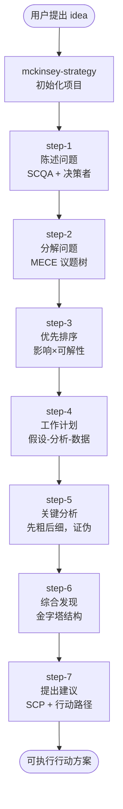

# 麦肯锡七步成诗战略分析法（总入口）

<HARD-GATE>
本 skill 是七步法的**唯一入口**。一旦用户开始战略分析，必须先走本 skill 完成项目初始化，然后由本 skill 触发 step-1。

**禁止**直接跳到 step-2 / step-3 / 中段任意步骤。如果用户想从中间继续，先读取 `docs/strategy/<code>/` 下已有产出物，再判断从哪一步续做。
</HARD-GATE>

## 本 skill 的目标

- 接住用户的原始 idea，**不立刻分析**
- 完成项目初始化：项目代号、目录、README
- 给用户一张全流程地图，让 ta 知道接下来会经历什么
- 触发 step-1（陈述问题）

## 全流程地图



每一步都有：
- 一份模板（在仓库根 `templates/`）
- 一份产出物（在 `docs/strategy/<code>/`）
- 一份硬门禁（拒绝跳步）
- 一份自检清单 + 反模式表

## 引导式对话流程

按以下顺序、**一次只问一个问题**（用 `AskUserQuestion`），不要一次抛多个：

### 第 1 步：欢迎 + 概览

向用户输出（中文）：

> 我会用麦肯锡七步成诗法，引导你把这个 idea 变成一份可执行的战略行动方案。整个过程会经历 7 步，每步产出一份 markdown 文档，落到 `docs/strategy/<项目代号>/`。
>
> 每一步都有硬门禁——上一步没完成不能进下一步，避免凑数。
>
> 我们先用 1 分钟做项目初始化。

### 第 2 步：要项目代号

用 `AskUserQuestion` 问：

> 给这次分析起个**项目代号**（kebab-case，3-5 个英文单词，将作为目录名）。例如：
> - `enter-southeast-asia-market`
> - `team-scale-5-to-10`
> - `pricing-model-v2`

接收后做合法性校验：
- 全小写
- 仅含 `[a-z0-9-]`
- 不以 `-` 开头/结尾
- 长度 3-50 字符

不合法则要求重输。

### 第 3 步：要原始 idea 的清晰表述

用 `AskUserQuestion`（或直接对话）问：

> 用 2-3 句话说明：
> 1. 你想要回答的问题是什么？
> 2. 是什么变化或事件触发了这个问题？
> 3. 决策者是谁（自己 / 团队 / 老板 / 客户 / 投资人）？

**注意**：在这一步**不要**对用户的回答做拆解或分析——那是 step-1 的事。这里只做记录。

### 第 4 步：创建项目骨架

用 Bash 工具执行：

```bash
mkdir -p docs/strategy/<code>
```

然后用 Write 工具创建 `docs/strategy/<code>/README.md`，内容包含：

```markdown
# 战略分析项目：<code>

- 创建日期：YYYY-MM-DD
- 决策者：<决策者>
- 状态：进行中（当前在 step-1）

## 原始 idea / 触发事件

<用户在第 3 步的回答原文，不加修饰>

## 七步导航

- [ ] step-1: 陈述问题 → `step-1-problem.md`
- [ ] step-2: 分解问题 → `step-2-tree.md`
- [ ] step-3: 优先排序 → `step-3-priorities.md`
- [ ] step-4: 工作计划 → `step-4-workplan.md`
- [ ] step-5: 关键分析 → `step-5-analysis.md`
- [ ] step-6: 综合发现 → `step-6-synthesis.md`
- [ ] step-7: 提出建议 → `step-7-recommendation.md`

## 进度日志

- YYYY-MM-DD: 项目启动，原始 idea 已记录
```

### 第 5 步：交接到 step-1

输出（中文）：

> 项目骨架已创建：`docs/strategy/<code>/`
>
> 接下来进入 **step-1: 陈述问题**——我们会用 SCQA 框架把模糊的问题精炼成一个**封闭式焦点问题**，并明确决策者画像、范围边界、成功标准。预计 10-20 分钟对话。
>
> 准备好了吗？

得到用户确认后，调用 `step-1-define-problem` skill。

## 复用与续做

如果用户输入"继续我的项目 X" 或类似：

1. 检查 `docs/strategy/X/` 是否存在
2. 读取 `docs/strategy/X/README.md` 看进度（哪些已打勾）
3. 检查最后一个完成的 step-N 产出物
4. 直接调用 `step-<N+1>-...` skill，不重做初始化

## 自检清单（完成门禁）

- [ ] 项目代号合法且唯一（不与已有 `docs/strategy/*/` 冲突）
- [ ] `docs/strategy/<code>/README.md` 已创建并写入原始 idea
- [ ] 用户已知晓 7 步全流程
- [ ] 已确认进入 step-1

## 反模式（红旗）

| 红旗信号 | 真相 |
| --- | --- |
| 用户问"那我现在该怎么办" | 你在抛术语，没用人话讲清下一步——重写交接语 |
| 跳过项目代号直接开干 | 后续产出物无处落，一定要先建目录 |
| 在本 skill 里就开始 SCQA | 越权，那是 step-1 的事 |
| 一次问 5 个问题 | 用 AskUserQuestion 一次一个，让用户喘气 |

## 完成后交接

本 skill 完成后，调用：**`step-1-define-problem`**

输入：
- 项目代号 `<code>`
- 原始 idea 文本
- 决策者描述

产出物路径约定：`docs/strategy/<code>/step-1-problem.md`
